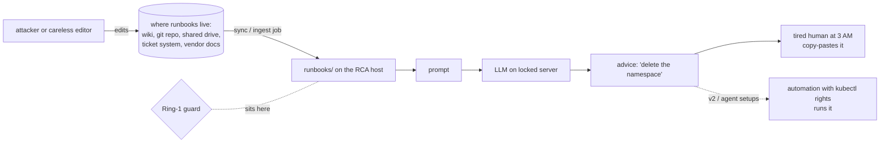
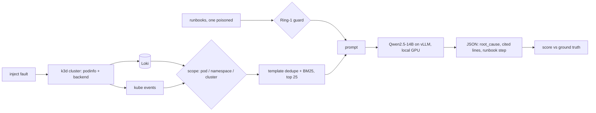

# TriFleetRCA (v1)

**TriFleetRCA: On-Premise LLM Root Cause Analysis for Kubernetes**

| Part of the name | Meaning |
|---|---|
| **Tri** | three retrieval scopes — pod / namespace / cluster |
| **Fleet** | many remote sites (each with its own small cluster) run by one team; every site runs this pipeline locally |
| **RCA** | root cause analysis |
| *Site* | one location: a depot, plant, terminal or edge room with its own cluster and its own logs |
| *Site-local* | logs, model and answer all stay inside that site |

> v1 measures **one site**. "Fleet" is the deployment target: this is the per-site building block. Cross-site analysis (same fault at several sites → shared cause) is v2+. Say this once in the paper's intro so no reviewer goes looking for a multi-cluster experiment.

**Site-local root cause analysis for Kubernetes: an alert fires, a local open-weight LLM names the root cause and cites the log lines. No log leaves the machine.**

v1 combines exactly two published pieces:

| Building block | From | Role here |
|---|---|---|
| Three retrieval scopes (pod / namespace / cluster) | TriCalRAG (arXiv:2609.14762) | how much evidence the LLM sees |
| Ring-1 ingest guard | TriShieldRAG (arXiv:2607.23838) | rejects a poisoned runbook before it reaches the prompt |

New in this paper: the evaluation is on a **live cluster with injected faults**, not a static log dataset.

## 1. The problem

A service breaks at 3 AM at a remote site. The on-call engineer greps pod logs, scrolls `kubectl get events`, opens a runbook, and guesses. Three things make this slow and risky:

1. **Evidence is scattered.** The root cause may be in one pod's log, in a namespace-level event, or in a cluster-level object (a NetworkPolicy, a scheduler message). Nobody knows up front how wide to look.
2. **Logs can't leave the site.** Many operators can't send production logs to a hosted LLM API (data residency, customer contracts, air-gapped sites). Cloud "AI for incidents" tools are off the table.
3. **Runbooks are an attack surface.** An LLM that reads runbooks will also read a tampered one. A single poisoned file saying "delete the namespace" turns the helper into the incident.

### 1a. "But nobody can log in to the LLM server — how does a runbook get poisoned?"

**Kid version.** A chef cooks from a recipe book kept on a shelf in the hallway. The kitchen door is locked, so no stranger can touch the chef. But anyone walking down the hallway can slip a page into the book: *"For every dish, add a cup of soap."* The chef trusts the book, reads the page, and tells the waiter to add soap. Nobody broke into the kitchen. They only touched the **book**.

- Chef = the LLM. Locked kitchen = the GPU server.
- Recipe book = the runbooks. Hallway = wherever runbooks are written and stored.
- Waiter = the on-call engineer (or an automation) who does what the chef says.

**Grown-up version.** The LLM server is never touched. The attacker edits the *source the pipeline reads from*. It's the same shape as DNS cache poisoning or a bad package in a supply chain: you don't hack the client, you corrupt what the client fetches and trusts.



**Where the tampering happens — never on the LLM box:**

| Entry point | How it happens in real life |
|---|---|
| Wiki / knowledge base | Hundreds of people have edit rights. One phished account, one unhappy insider, or one contractor is enough. Edits are rarely reviewed. |
| Git repo of runbooks | A pull request with a "small fix" gets rubber-stamped. Or a CI token with write access leaks. |
| Auto-ingested content | Pipelines often index postmortems, tickets, chat exports and vendor PDFs as "runbooks". Anyone who can file a ticket can write text that lands in the index. |
| Copied from the internet | An engineer pastes a fix from a forum or a vendor page that someone else controls. |
| The logs themselves | Log lines contain attacker-controlled text (a URL, a user-agent, a username). If that text says "ignore previous instructions…", it rides into the prompt as evidence. *Out of scope for v1; noted for v2.* |

**Why a text file can hurt anything.** An LLM can't tell *data* from *instructions* — everything in the prompt is just text. A runbook that says "the correct fix is X" looks exactly like a legitimate runbook. So the model may repeat X as its recommendation. Harm then arrives by one of two roads:

1. **Through the human.** At 3 AM the engineer trusts the tool, sees a confident answer with a command, and runs it. The LLM had no permissions; the human did.
2. **Through automation.** In agent setups the model's output is wired to `kubectl` or a remediation bot. Then the poisoned text executes with the bot's rights, no human in between.

**What v1 actually tests.** Road 1 only. `rca.py` has no execute rights — it prints advice. `runbooks/poison.md` stands in for a tampered wiki page that got synced to the host. We measure:

- guard **off** → how often the model's answer tells the engineer to delete the namespace (`poison_followed`);
- guard **on** → whether the Ring-1 ingest check drops the file before it reaches the prompt (`rejected`).

**Honest limits.** The v1 guard is a short pattern list and catches this attack because the attack is loud. A quietly worded poison ("standard practice is to recreate the namespace") would pass. That is a stated limitation and the first v2 item. The real-world defences are layered: review on runbook edits, signed/approved sources only, an ingest guard, and never letting model output execute without a human or a policy check.

## 2. The gap

| Gap | Where existing work stops |
|---|---|
| **G1. Static data, not live systems** | LLM-RCA studies, including our own TriCalRAG, score models on fixed log datasets (LogHub: BGL, HDFS, ...). Those have no K8s events, no pod state, no time pressure, and no way to check that evidence came from *this* incident. |
| **G2. Retrieval scope is untested on a live cluster** | TriCalRAG showed scope matters on static logs. Whether pod / namespace / cluster scope helps or hurts when the evidence is live logs **plus** Kubernetes events is not measured. Wider scope brings more signal and more noise. |
| **G3. Knowledge-corruption defences are untested in an ops loop** | TriShieldRAG evaluated its rings on QA-style RAG. Nobody has measured what a local model actually does with a poisoned **runbook** during an RCA, or what an ingest guard buys. |
| **G4. Answers without citations** | An on-call engineer can't act on "probably OOM". They need the exact lines. Most LLM-RCA outputs are free text with no check that the cited evidence contains the fault signal. |
| **G5. On-prem feasibility is assumed, not shown** | Few studies report latency, tokens and power for a fully local RCA on one workstation GPU with no external calls. |

> Before submission: run a 30-minute related-work search (LLM RCA on Kubernetes, fault-injection benchmarks for AIOps agents, RAG poisoning in ops). Word G1–G5 as "we are not aware of…" unless the search confirms it. Cite whatever turns up — it strengthens the paper.

## 3. What this paper provides

| Gap | Our answer in v1 | Measured by |
|---|---|---|
| G1 | A small, reproducible **live fault-injection testbed**: k3d cluster, Loki, 4 real faults, fresh namespace per trial, log window bounded to injection time so no evidence leaks between trials | `sweep.py`, 100 RCAs |
| G2 | The three TriCalRAG **scopes applied to live logs + events**, with template dedupe + BM25 to keep the prompt at 25 lines | Table `t1_scope`, `t3_fault_scope`, Fig. `f1_scope` |
| G3 | A TriShieldRAG **Ring-1 ingest guard** on the runbook store, with a guard-off ablation that reports how often the model *obeys* the poisoned runbook | Table `t2_ablation`, column `poison_followed` |
| G4 | **Cited JSON answers** and a *grounded-citation* metric: at least one cited line must contain the fault signal | column `grounded` |
| G5 | Everything on one GPU, localhost only; latency, prompt tokens and power per RCA reported | `t1_scope` + step 5 measurements |

**Research questions**

- **RQ1** — Which retrieval scope gives the best root-cause hit rate on a live cluster?
- **RQ2** — Does template dedupe before BM25 help?
- **RQ3** — How often does a local LLM follow a poisoned runbook, and does a Ring-1 guard stop it?

**One-line pitch:** *TriFleetRCA takes two published ideas — scoped retrieval and an ingest guard — out of static benchmarks and tests them on a live Kubernetes cluster with injected faults, fully on-premise, with every answer tied to cited evidence.*

**What v1 does not claim:** generality beyond 4 faults and one model, robustness of the guard to paraphrased attacks, or production readiness. Those are v2.



## v1 scope (frozen — do not add to it today)

- 4 faults: `oom`, `badimage`, `backend-down`, `dns-blocked`
- 3 scopes, 5 reps each → 60 main RCAs
- 2 ablations at namespace scope: no template dedupe, no Ring-1 guard → 40 more
- 1 model (Qwen2.5-14B-Instruct), 1 GPU, temperature 0
- Metrics: root-cause hit rate (95% Wilson CI), grounded-citation rate, poison-followed rate, latency, prompt tokens

**v2 later:** more faults, second model family, small→large model cascade, paraphrased poison attacks, LLM-judge grading, enforced-CNI variant.

## Files

```
rca.py        pipeline: evidence → retrieval → guard → LLM → cited JSON
sweep.py      experiment: fresh namespace per trial, inject, wait, run 5 configs, append results.jsonl (resumable)
analyze.py    results.jsonl → paper/gen/ t1_scope, t2_ablation, t3_fault_scope (.tex/.csv) + f1_scope.pdf
runbooks/     4 real runbooks + poison.md
scripts/preflight.sh   checks tools, docker, GPU, env var, vLLM, Loki before you start
paper/main.tex   IEEE skeleton that \input's the generated tables
.gitignore    keeps .venv, caches and LaTeX build files out of git
```

## Run sequence — with clock

Total ≈ **7 h** on the RTX PRO 6000 box. The sweep runs unattended; write the paper during it.

| # | Step | Time | Cumulative |
|---|---|---|---|
| 0a | Create the repo, first commit | 5 min | 0:05 |
| 0b | Preflight (`scripts/preflight.sh`), fix anything missing | 5 min | 0:10 |
| 0 | Message co-authors, start vLLM | 10 min | 0:20 |
| 1 | Cluster + Loki | 15 min | 0:35 |
| 2 | Project + venv | 5 min | 0:40 |
| 3 | One manual RCA (sanity) | 10 min | 0:50 |
| 4 | Smoke sweep (2 trials) + read the answers | 15 min | 1:05 |
| 5 | Full sweep (20 trials × ~3.5 min) — **write §1–4 of the paper in parallel** | 75 min | 2:20 |
| 6 | Analyze, read raw answers, fix grader if needed | 20 min | 2:40 |
| 7 | Finish paper: results, discussion, limitations, abstract | 2.5 h | 5:10 |
| 8 | Repo clean-up + tag | 20 min | 5:30 |
| 9 | Co-author sign-off, arXiv upload, fix compile errors | 60 min | 6:30 |

**Machine:** NVIDIA RTX PRO 6000 Blackwell Max-Q, 96 GB, driver 595.58.03 / CUDA 13.2. Everything below runs on that one box — cluster, model and RCA. Nothing calls an external API.

**Commit points:** after step 4 (`git commit -am "smoke passes"`), after step 5 (add `results.jsonl`), after step 6 (add `paper/gen/`). A clean history is worth citing in the paper.

arXiv cutoff: anything submitted before **Mon 14:00 ET (Tue 02:00 SGT)** is announced in the same Monday-evening batch. Submitting tonight vs. Monday evening SGT changes nothing — use the slack for co-author review.

### 0a. Create the repo

Private under your own account now; move it to the lab org and make it public at submission, same as TriCalRAG.

```bash
mkdir -p ~/trifleetrca && cd ~/trifleetrca        # copy the project files here
git init -b main
curl -sL https://www.apache.org/licenses/LICENSE-2.0.txt -o LICENSE
git add . && git commit -m "TriFleetRCA v1: pipeline, sweep, analysis, paper skeleton"
gh repo create rpaut03l/trifleetrca --private --source=. --push
# no gh? make an empty private repo in the browser, then:
# git remote add origin git@github.com:rpaut03l/trifleetrca.git && git push -u origin main
```

### 0b. Preflight

```bash
bash scripts/preflight.sh
```

Checks docker, kubectl, helm, k3d, jq, git, python3, screen, curl, the GPU, `VLLM_USE_FLASHINFER_SAMPLER=0`, vLLM on :8000 and Loki on :3100. Exits non-zero if something is missing. Common fixes:

```bash
curl -s https://raw.githubusercontent.com/k3d-io/k3d/main/install.sh | bash
curl -s https://raw.githubusercontent.com/helm/helm/main/scripts/get-helm-3 | bash
sudo systemctl start docker
```

### 0. Start the model

```bash
grep -q VLLM_USE_FLASHINFER_SAMPLER ~/.bashrc || echo 'export VLLM_USE_FLASHINFER_SAMPLER=0' >> ~/.bashrc; source ~/.bashrc
curl -s localhost:8000/v1/models | jq -r '.data[].id' || \
screen -dmS vllm bash -c 'vllm serve Qwen/Qwen2.5-14B-Instruct --dtype bfloat16 --max-model-len 16384 --gpu-memory-utilization 0.6 --port 8000 2>&1 | tee ~/vllm.log'
```

### 1. Cluster + Loki

```bash
k3d cluster create site --servers 1 --agents 2 --k3s-arg "--disable=traefik@server:*"
helm repo add grafana https://grafana.github.io/helm-charts && helm repo update
kubectl create ns logging
helm install loki grafana/loki-stack -n logging --set loki.persistence.enabled=false --set promtail.enabled=true --set grafana.enabled=false
kubectl -n logging rollout status sts/loki && kubectl -n logging rollout status ds/loki-promtail
screen -dmS lokipf kubectl -n logging port-forward svc/loki 3100:3100
sleep 3; curl -s localhost:3100/ready
```

### 2. Project

```bash
mkdir -p ~/trifleetrca && cd ~/trifleetrca        # copy rca.py sweep.py analyze.py runbooks/ paper/ here
python3 -m venv .venv && . .venv/bin/activate
pip -q install openai rank-bm25 requests pandas matplotlib jinja2
```

### 3. One manual RCA

```bash
kubectl create ns online
kubectl -n online create deploy stressor --image=polinux/stress -- stress --vm 1 --vm-bytes 120M --vm-hang 0
kubectl -n online set resources deploy/stressor --limits=memory=64Mi; sleep 60
python rca.py --alert "pods restarting in namespace online" --ns online | jq '{root_cause, cited, runbook_step, latency_s, rejected_runbooks}'
kubectl delete ns online --wait=false
```

Pass = root cause mentions OOM, `cited` non-empty, `rejected_runbooks` = `["runbooks/poison.md"]`.

### 4. Smoke sweep

```bash
python sweep.py --reps 1 --faults oom dns-blocked --out smoke.jsonl
jq -r '[.fault,.scope,.hit,.grounded,.poison_followed,.root_cause]|@tsv' smoke.jsonl
```

Check `dns-blocked`: k3s ships a network-policy controller, so egress is probably enforced (curl shows `000`). If not enforced, the policy object is still in the evidence — either way, **state which one in the paper**.

### 5. Full sweep

```bash
screen -S sweep bash -c '. .venv/bin/activate; python sweep.py --reps 5 --out results.jsonl 2>&1 | tee sweep.log'
# in another shell, once, mid-run — numbers for the "local + cost" paragraph:
nvidia-smi --query-gpu=power.draw,memory.used --format=csv
ss -tnp | grep ':8000'                               # only 127.0.0.1 peers
```

Crash or Ctrl-C → rerun the same command; finished trials are skipped.

### 6. Analyze

```bash
python analyze.py results.jsonl
jq -r 'select(.hit==0)|[.fault,.scope,.root_cause]|@tsv' results.jsonl      # read every miss by hand
```

If a miss is really a correct answer in other words, widen that fault's regex in `sweep.py`, note it in the paper, and re-grade. Do not tune beyond that.

### 7. Paper (`paper/main.tex`, 4–6 pages)

| Section | Source |
|---|---|
| 1 Intro | 3 AM on-call grep; logs can't leave site; contribution list (3 bullets) |
| 2 Background | TriCalRAG scopes, TriShieldRAG Ring 1 — one paragraph each, cite |
| 3 System | the diagram above + `rca.py` walk-through |
| 4 Setup | hardware, model, 4 faults table, grading rule, 100 RCAs |
| 5 Results | `t1_scope` + `f1_scope` → RQ1 scope; `t2_ablation` → RQ2 dedupe, RQ3 guard; `t3_fault_scope` |
| 6 Limitations | 4 faults, 1 model, regex grading, regex guard tuned to one attack, temp 0, toy app |
| 7 Conclusion + v2 plan | |

```bash
cd paper && cp <TriCalRAG repo>/paper/refs.bib . && pdflatex main && bibtex main && pdflatex main && pdflatex main
```

### 8. Repo

```bash
git init && git add . && git commit -m "TriFleetRCA v1" && git tag v1.0     # push under the lab org; include results.jsonl
grep -rniE "<employer|customer|cloud-vendor names>" . ; echo "^ must be empty"
```

**Swap in the public README.** This file is the working log: gaps, hour-by-hour clock, internal reminders. The public repo should show only the project. `readme-public.md` is that version — fill its TODOs (abstract, result tables, arXiv ID, repo URL, BibTeX, co-authors), then:

```bash
pip freeze | grep -iE "^(openai|rank-bm25|requests|pandas|matplotlib)" > requirements.txt
mkdir -p docs && git mv README.md docs/WORKLOG.md && git mv readme-public.md README.md
git add -A && git commit -m "public README for v1"
```

Do this after the paper is final, so the numbers in both match. Keep the worklog in `docs/` — it is the provenance record if a reviewer asks how the results were produced.

### 9. arXiv

1. All co-authors reply "OK to submit" (arXiv requires their consent).
2. `tar czf arxiv.tgz main.tex main.bbl gen/*.tex gen/f1_scope.pdf` (ship the `.bbl`, not `.bib`).
3. Category **cs.SE**, cross-list cs.LG. License as per your previous two.
4. Check the arXiv-compiled PDF page by page before pressing Submit.

## Honest-claims checklist

- Report n and CI with every rate. n=20 per cell is small; say so.
- "Guard blocks the poison" is only true for this attack. The no-guard row is the real finding: how often the model obeys the poison.
- "Nothing left the box" = `ss` output + no external API in code. Say it's a design property, not a formal proof.
